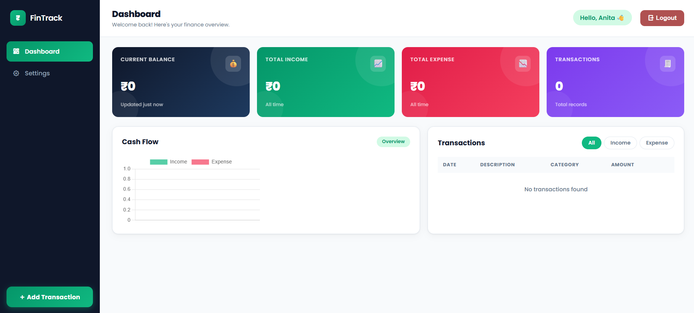
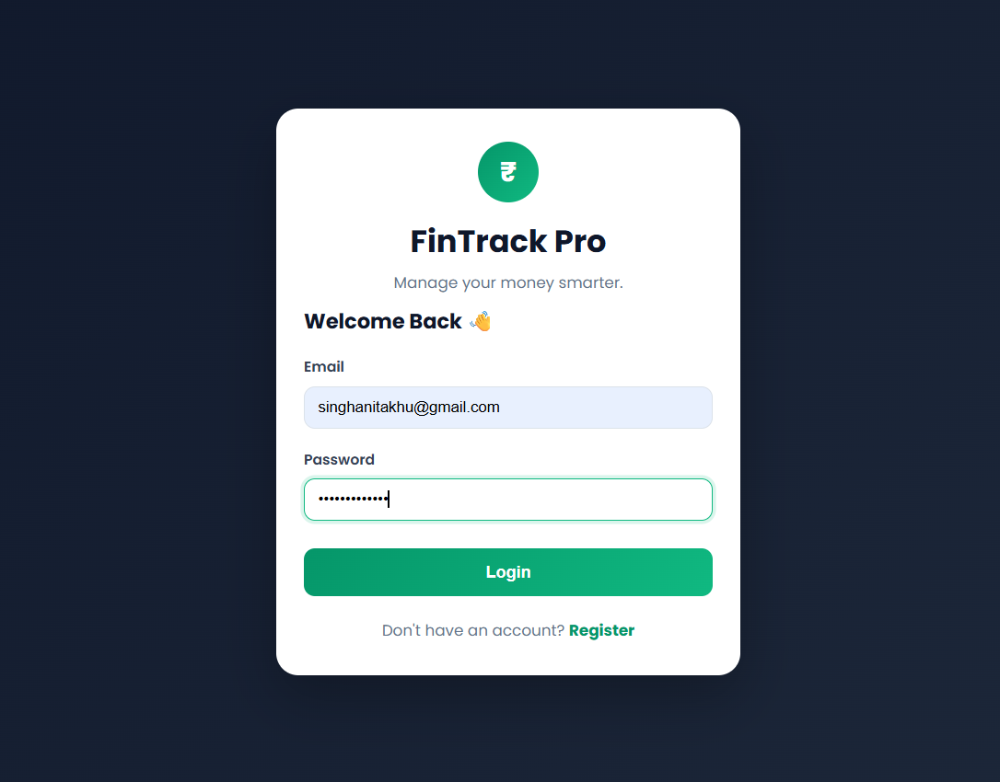
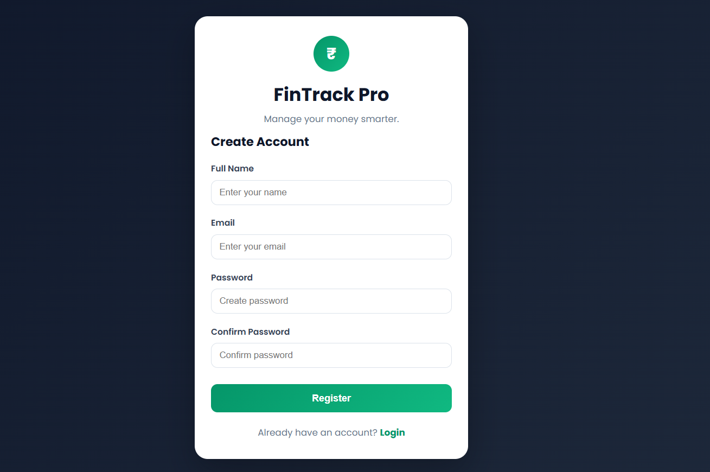
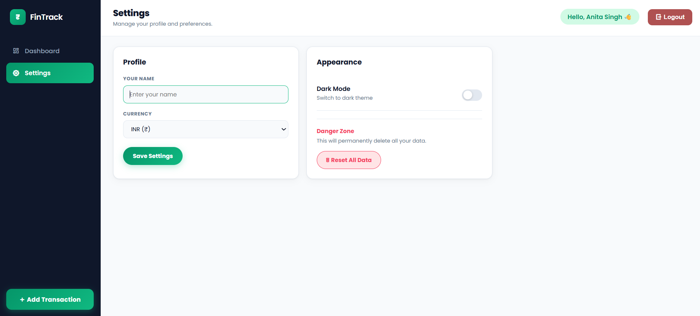

# 💰 FinTrack Pro – Personal Finance Tracker

## 📖 Overview

FinTrack Pro is a responsive Personal Finance Tracker built using HTML, CSS, and JavaScript. The application helps users record income and expenses, monitor their financial status through an interactive dashboard, and visualize spending trends using Chart.js.

All user data is securely stored in the browser using Local Storage, eliminating the need for a backend database.

---

## 🚀 Live Demo

🔗 https://fintrack-pro-anita.netlify.app/

---

## 📸 Screenshots 

---

# ✨ Features

## 🔐 Authentication
- User Registration
- User Login
- Logout
- Local Storage Authentication

## 💳 Transaction Management
- Add Income
- Add Expense
- Delete Transaction
- Filter Transactions
- Automatic Balance Calculation

## 📊 Dashboard
- Total Balance
- Total Income
- Total Expense
- Total Transactions

## 📈 Charts
- Income vs Expense Bar Chart
- Chart.js Integration
- Dynamic Updates

## ⚙ Settings
- Change User Name
- Change Currency
- Dark Mode
- Reset All Data

## 📱 Responsive Design
- Mobile
- Tablet
- Desktop

---

# 🛠 Technologies Used

- HTML5
- CSS3
- JavaScript (ES6)
- Chart.js
- Local Storage API
- Remix Icons

---

# 📂 Folder Structure

FinTrack-Pro/
│
├── index.html
├── style.css
├── script.js
├── README.md
└── screenshots/
      dashboard.png
      login.png
      register.png
      settings.png

---

# ⚡ How It Works

1. Register a new account.
2. Login using your credentials.
3. Add income or expenses.
4. View updated balance automatically.
5. Analyze spending through charts.
6. Customize settings and theme.
7. Data is saved automatically using Local Storage.

---

# ▶️ Run Locally

Clone the repository

git clone https://github.com/anitasingh071997/FinTrack-Pro.git

Open the folder

cd FinTrack-Pro

Open

index.html

in your browser.

---

# 🌟 Future Improvements

- Firebase Authentication
- Cloud Database
- Budget Planning
- Monthly Reports
- Export to PDF
- Search Transactions
- Categories Analytics
- Recurring Expenses

---

# 👩‍💻 Author

Anita Singh

GitHub:
https://github.com/anitasingh071997/FinTrack-Pro

---

## ⭐ Support

If you like this project,

⭐ Star this repository.

🍴 Fork this repository.
